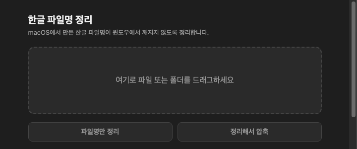
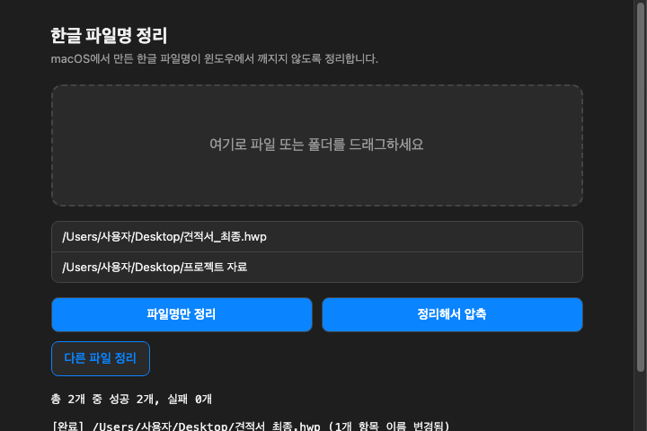

# 한글 파일명 정리

macOS에서 만든 파일을 윈도우 사용자에게 공유하면 한글 파일명이 깨져 보이는 경우가 있습니다.
이 앱은 그 문제를 해결하기 위한 **로컬 전용** 도구입니다. 서버로 파일을 보내지 않고, 내 맥북 안에서만
동작합니다.

## 왜 깨질까요?

- macOS는 한글 파일명을 자음/모음이 분리된 형태(NFD)로 저장하는 경우가 있습니다. 윈도우는 이걸
  정상적으로 조합해서 보여주지 못해 깨져 보입니다.
- 압축할 때는 문제가 하나 더 생깁니다. 맥의 기본 압축 유틸리티가 만든 zip 파일에는 "파일명이
  UTF-8이다"라는 표시가 빠져 있는 경우가 있어서, 윈도우가 이를 완전히 다른 방식(CP949)으로
  해석해버립니다.

## 이 앱이 하는 일

1. **파일명만 정리**: 드래그한 파일/폴더(하위 폴더 포함)의 이름을 윈도우와 호환되는 정상 형태(NFC)로
   바꿔줍니다.
2. **정리해서 압축**: 이름을 정리한 뒤, 윈도우에서 정상적으로 인식되는 zip 파일로 압축합니다.

압축 전에는 `node_modules`처럼 불필요하게 크거나 경로가 너무 긴 항목이 섞여 있는지도 자동으로
확인해서, 윈도우에서 압축 해제가 실패할 만한 상황이면 미리 알려줍니다.

## 화면

<p>
  
  
</p>

## 설치

1. [Releases](../../releases)에서 내 맥에 맞는 `.dmg`를 내려받습니다.
   - Apple Silicon(M 시리즈) 맥 → `macOS-fileShare-window.dmg`
   - 인텔(Intel) 맥 → `macOS-fileShare-window-intel.dmg`
   - 애매하면 왼쪽 위 사과 메뉴 → **이 Mac에 관하여**에서 칩 이름을 확인하세요.
2. 내려받은 `.dmg`를 더블클릭하면 창이 하나 뜹니다. 안에 있는 앱 아이콘을 옆의
   **Applications** 폴더 아이콘으로 드래그하면 설치가 끝납니다. (다른 mac 앱들과 동일한 방식)
3. 처음 실행할 때 macOS가 "확인되지 않은 개발자입니다" 라는 경고를 띄우며 열리지 않을 수
   있습니다. 개인이 만든 무료 앱이라 별도의 Apple 인증(유료)을 받지 않았기 때문입니다.
   아래 중 한 가지 방법으로 최초 1회만 우회하면, 이후에는 평소처럼 더블클릭으로 바로 열립니다.

   - **방법 A**: 앱 아이콘을 **우클릭(또는 control+클릭) → 열기** → 뜨는 경고창에서 다시
     **열기** 버튼 클릭.
   - **방법 B**: 터미널에서 아래 명령 실행 후 다시 더블클릭.

     ```bash
     xattr -dr com.apple.quarantine "/Applications/한글 파일명 정리.app"
     ```

4. 독(Dock)의 앱 아이콘을 우클릭 → **옵션 → Dock에 유지**로 고정해두면 계속 독에서 바로
   쓸 수 있습니다.
5. 앱 창에 정리하고 싶은 파일/폴더를 드래그하고, "파일명만 정리" 또는 "정리해서 압축" 버튼을
   누릅니다.

## 참고

- Apple Silicon(M 시리즈)·인텔 맥 빌드를 모두 배포합니다. 다운로드한 `.dmg`가 내 맥의 칩과 맞지
  않으면 실행이 안 되니, 설치 1번의 안내를 참고해 올바른 쪽을 받으세요.
- 압축 결과물은 7-Zip 등 대부분의 압축 프로그램과 macOS에서 정상적으로 열립니다. 윈도우 기본
  탐색기(우클릭 → 압축 풀기)로 풀 때 간헐적으로 깨지는 경우가 보고되어 있으며, 이는 윈도우
  탐색기 자체의 한계로 아직 해결하지 못했습니다. 이런 경우 받는 분께 7-Zip 사용을 권해주세요.

## 직접 빌드하기 (개발자용)

```bash
npm install
npm run dist       # 내 맥 아키텍처용 .app만 빌드 (빠름, 개발 중 테스트용)
npm run dist:dmg   # 내 맥 아키텍처용 .app + .dmg 빌드
npm run dist:all   # arm64 + x64 둘 다 .app + .dmg로 빌드 (배포용, x64는 최초 1회 추가 다운로드 발생)
```

빌드가 끝나면 `dist/`에 `.app`과 `.dmg`가 생성됩니다.
